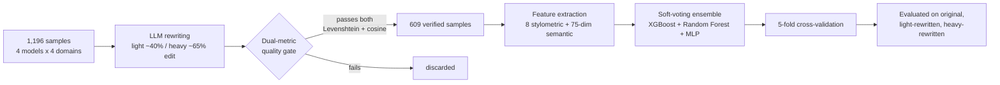
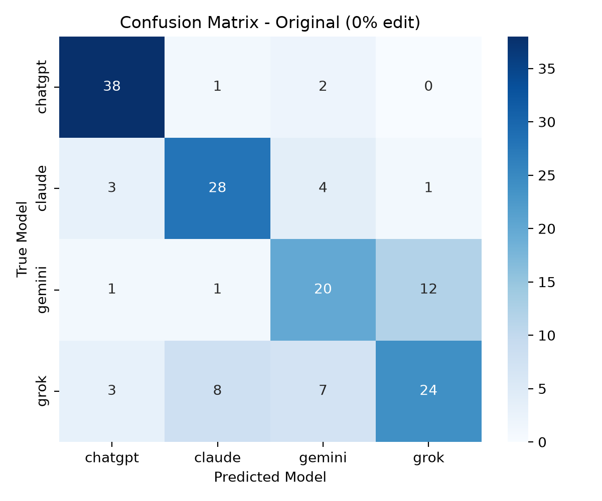
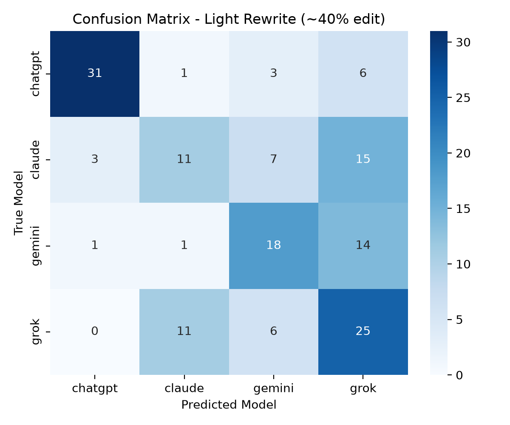
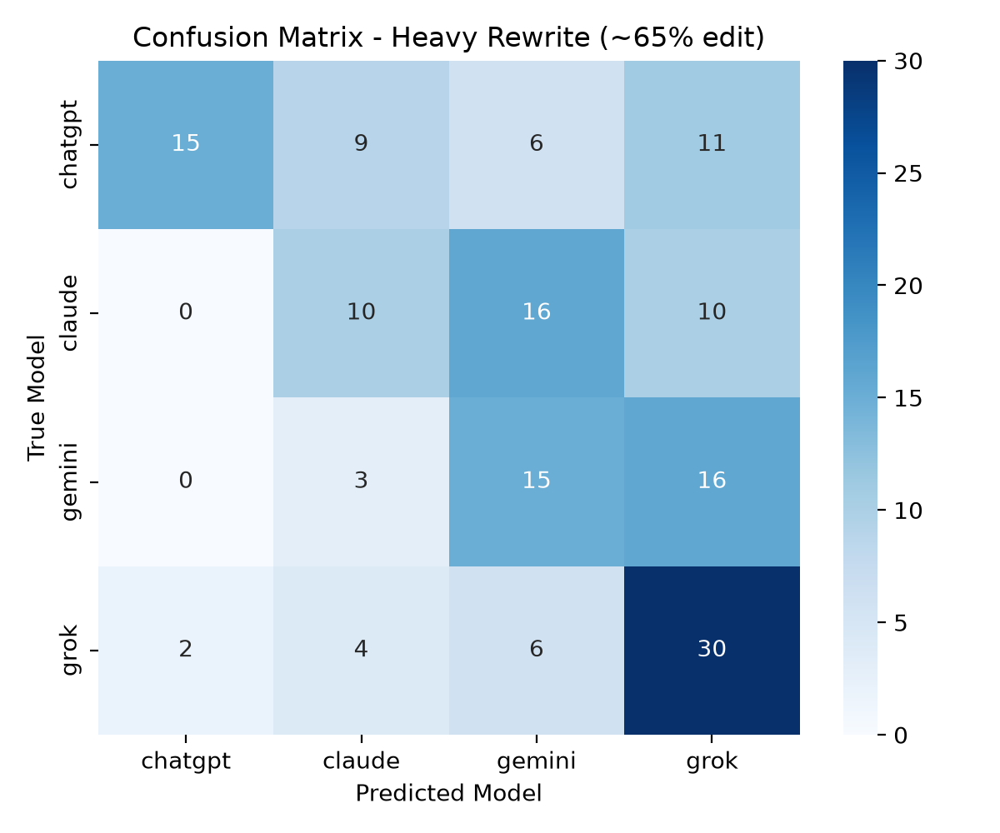
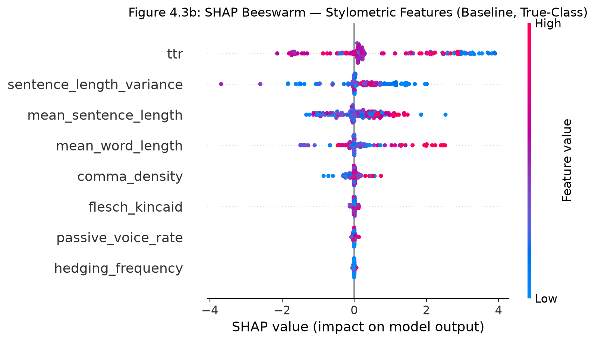
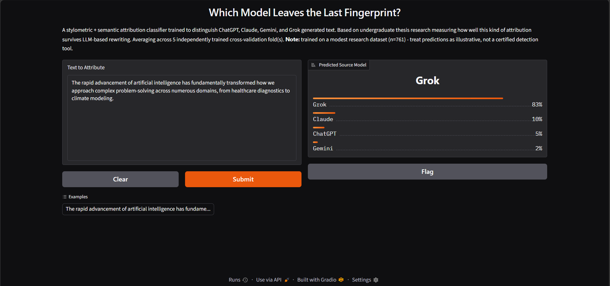

<p align="center">
  
  
  
  
  
</p>

<p align="center"><i>An undergraduate thesis project — BSc Management Information Systems, NSBM Green University</i></p>

---

## 🧭 The question

Four different AI labs — OpenAI, Anthropic, Google, and xAI — each trained a model that writes fluent English. Strip away the branding, and hand someone a paragraph of pure text: **can you still tell which model wrote it?**

And if someone runs that text through a *second* AI to paraphrase it and hide its tracks — does the fingerprint survive, or does it wash out completely?

This project builds a classifier to answer both questions, and is honest about the answer even when it isn't a clean "yes."

## 📋 Table of contents

- [How it works](#-how-it-works)
- [Key results](#-key-results)
- [What the model actually pays attention to](#-what-the-model-actually-pays-attention-to)
- [Try it yourself](#-try-it-yourself)
- [Repository structure](#-repository-structure)
- [Limitations](#-limitations)

## ⚙️ How it works



The quality gate is the part most pipelines skip: an LLM asked to rewrite text "40% differently" doesn't reliably hit that target, and it doesn't reliably preserve meaning either. Every rewrite here is checked on **both** word-level Levenshtein distance (did it actually change enough?) and cosine similarity on sentence embeddings (did it keep the same meaning?) before it's allowed into the dataset — only 609 of the original 1,196×2 rewrite attempts pass both checks.

## 📊 Key results

| Condition | Macro F1 | vs. chance (0.25) |
|---|:---:|:---:|
| **Baseline** (unmodified text) | `0.7061` ± 0.0234 | 2.8× |
| **Light rewrite** (~40% edit) | `0.5301` ± 0.0245 | 2.1× |
| **Heavy rewrite** (~65% edit) | `0.4017` ± 0.0231 | 1.6× |

<table>
<tr>
<td width="33%"></td>
<td width="33%"></td>
<td width="33%"></td>
</tr>
<tr>
<td align="center"><sub>Original text</sub></td>
<td align="center"><sub>Light rewrite (~40%)</sub></td>
<td align="center"><sub>Heavy rewrite (~65%)</sub></td>
</tr>
</table>

Attribution accuracy drops as rewriting intensity increases — expected, and exactly what the research question asked about — but stays well above the 25% chance floor for 4 classes even under heavy paraphrasing. The signal degrades; it doesn't disappear.

## 🔍 What the model actually pays attention to

SHAP analysis on the ensemble's XGBoost component, restricted to each sample's true class:

<p align="center"></p>

Lexical diversity (type-token ratio) and sentence-length statistics carry the most signal on unmodified text — but they're also the features rewriting attacks *most successfully* (they drop to 77–87% of their original importance under heavy editing). The features that survive rewriting best — comma density, hedging frequency — aren't the strongest signals to begin with. There's a real trade-off between how *informative* a stylometric feature is and how *robust* it is to paraphrasing.

## 🚀 Try it yourself

<p align="center"></p>

```bash
pip install -r requirements.txt
python -m spacy download en_core_web_sm
python app.py
```

Opens a local Gradio interface — paste any paragraph of text and get a live 4-way prediction, averaged across all 5 independently trained cross-validation folds.

## 🗂️ Repository structure

```
├── app.py                          # Gradio demo — paste text, get live model attribution
├── requirements.txt
├── generate_full_rewrites.py       # LLM-based rewriting pipeline with quality-gate retry logic
├── compute_cosine_gate.py          # Dual-metric (Levenshtein + cosine) quality gate
├── extract_features.py             # Stylometric feature extraction
├── extract_embeddings.py           # Semantic embedding extraction
├── train_classifier_v2.py          # 5-fold CV training (single fold saved)
├── train_all_folds.py              # Same training, saves all 5 fold pipelines (used by app.py)
├── ablation_study_v2.py            # Stylometric-only / semantic-only / combined ablation
├── shap_analysis_v3.py             # SHAP feature-survival analysis on the trained ensemble
├── confusion_matrices.py           # Confusion matrices for baseline/light/heavy
├── verify_alignment.py             # Data integrity checks
├── master_clean_originals.csv      # Source dataset (1,196 samples)
├── master_rewritten_samples_FINAL.csv
├── features_extracted.csv
├── semantic_embeddings.npy
├── fold1_pipeline.pkl … fold5_pipeline.pkl   # Trained model pipelines (one per CV fold)
└── *.png / *.csv                   # Confusion matrices, SHAP beeswarm, ablation results
```

## ⚠️ Limitations

Trained on a modest research dataset (609 gate-passing samples after quality filtering across 4 classes) — predictions are illustrative of the research findings, not a certified detection tool. See the full thesis for methodology, related work, and discussion.

---

<p align="center"><sub>Built by H.P.H. Dulshan · BSc (Hons) Management Information Systems Special · NSBM Green University</sub></p>
